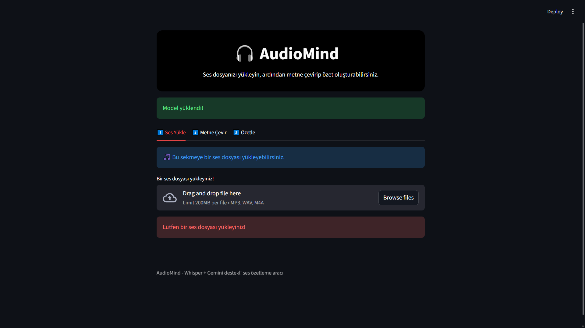
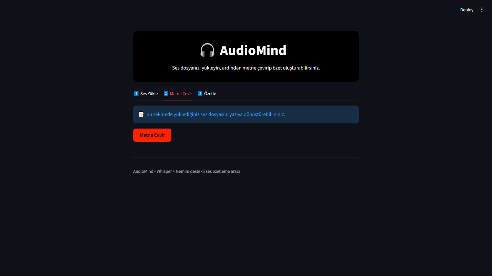
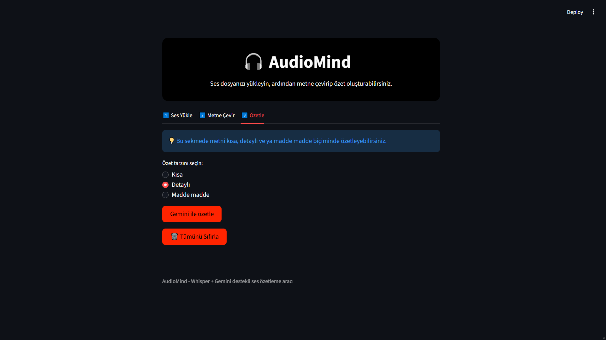

# 🎧 AudioMind: Ses -> Metin -> Özet Dönüştürücü  
**Akbank GenAI Bootcamp Projesi**

---

## 🎯 Projenin Amacı  
AudioMind, kullanıcıların ses kayıtlarını yükleyerek bu kayıtları metne dönüştürebilmesini ve ardından bu metni **Google Gemini** modeli ile özetleyebilmesini sağlayan bir yapay zekâ uygulamasıdır.  
Proje, **Whisper** (Speech-to-Text) ve **Gemini** (Text Summarization) modellerini bir araya getirerek “Ses → Metin → Özet” akışını kolay ve etkileşimli bir web arayüzü üzerinden gerçekleştirir.

Bu proje ile hedeflenen:
- Uzun ses kayıtlarını metin formatına dönüştürmek  
- Metin içerisinden anlamlı özetler elde etmek  
- Tüm süreci sade bir web arayüzüyle kullanıcıya sunmak  

---

## 📚 Veri Seti Hakkında  
Bu projede doğrudan bir veri seti kullanılmamıştır.  
Whisper modeli, ses dosyasını doğrudan metne dönüştürmek için eğitilmiş bir yapay zekâ modelidir.  
Kullanıcıdan alınan ses dosyası (örneğin `.mp3`, `.wav`) uygulama içerisinde geçici olarak işlenir ve **lokal olarak metne çevrilir**.  
Bu nedenle, veri gizliliği korunur; hiçbir ses veya metin harici sunuculara gönderilmez.

---

## 🧠 Kullanılan Teknolojiler ve Yöntemler  

| Teknoloji | Amaç |
|------------|-------|
| **Python** | Ana geliştirme dili |
| **Streamlit** | Web arayüzü geliştirme |
| **OpenAI Whisper** | Ses → Metin dönüşümü |
| **Google Gemini API** | Metin özetleme |
| **Dotenv** | Ortam değişkeni yönetimi |
| **Tempfile / OS** | Geçici dosya yönetimi |

### 🔧 Genel Akış (Pipeline)
1. Kullanıcı ses dosyasını yükler.  
2. Whisper modeli bu ses dosyasını **metne çevirir**.  
3. Elde edilen metin, kullanıcı seçimine göre (“Kısa”, “Detaylı”, “Madde madde”) biçiminde **Gemini modeliyle özetlenir**.  
4. Özet ekran üzerinde gösterilir ve `.txt` formatında indirilebilir.  

---

## 🏗️ Çözüm Mimarisi  

```text
📁 AudioMind
│
├── app.py                # Ana uygulama dosyası
├── requirements.txt      # Gereken kütüphaneler listesi
├── .env                  # API anahtarlarının tutulduğu gizli dosya
└── images/               # Ekran görüntüleri

---

## 📷 Ekran Görüntüleri  
**1) Ses Yükleme**  
  

**2) Metne Çevirme (Transkript Görünümü)**  
  

**3) Özetleme ve İndirme**  
  

---

## 🚀 Kurulum  
1. Gerekli paketleri yükle:  
   ```bash
   pip install -r requirements.txt

